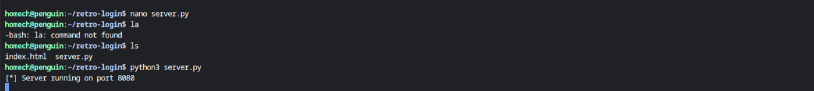
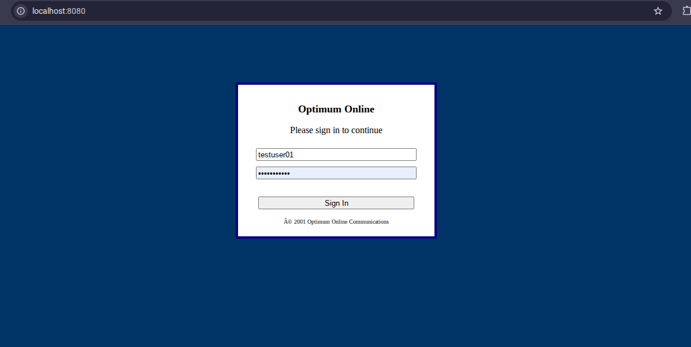
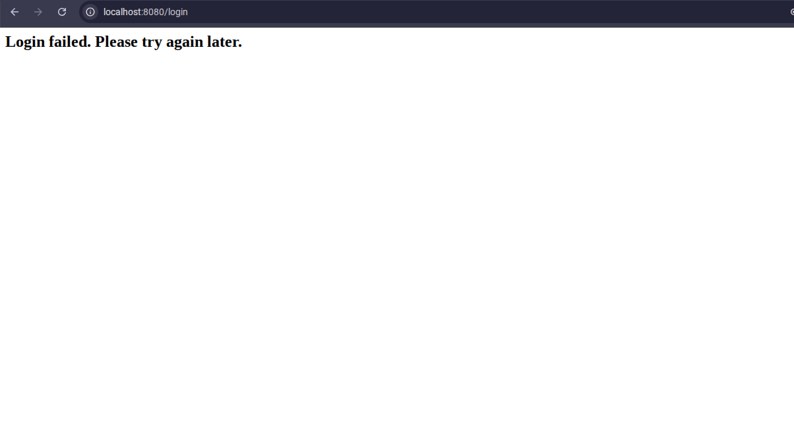
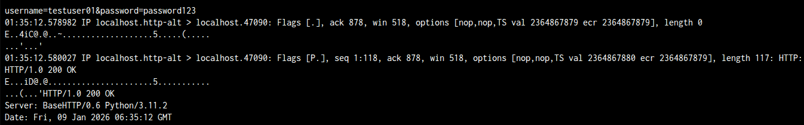
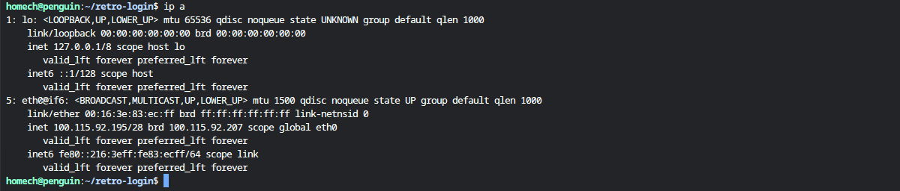

# HTTP Credential Capture Demo

## Overview

This project demonstrates a **controlled, local experiment** to capture HTTP credentials submitted from a browser to a Python web server.  

**Important:** This project is ** for educational use only**. It is run entirely on **local machines under my control**. No real users, networks, or sensitive credentials were harmed.  

The goal is to demonstrate understanding of:

- Setting up a simple Python HTTP server  
- Capturing HTTP traffic on a local device  
- Understanding network interfaces and IP differences on Linux on a Chromebook  

---

## Ethical Disclaimer

All activity in this project is **strictly legal and ethical**:

- Only test accounts are used  
- Only my own devices and local network are involved  
- No credentials from other people, services, or networks were collected  

---

## Project Setup

1. **Python Web Server** – Laptop A (Chromebook) running Linux hosts a simple HTTP login page on port 8080.
2. **Browser Login** – Test credentials submitted through the local HTML page.
3. **Traffic Capture** – Terminal on Laptop A captures HTTP POST request using `tcpdump` to demonstrate credential transmission.
4. **IP Address Verification** – Terminal shows the Chromebook’s Linux IP to illustrate network environment.

---

## Evidence (All on Laptop A)

1. **Server running**  
   

2. **Browser login form**  
   

3. **Credentials submitted**  
   

4. **Captured HTTP credentials (zoomed)**  
   

5. **Linux IP configuration on Chromebook**  
   

---

## Notes on Wireshark / Network Limitations

Because this project was run on a **Chromebook using Linux (Crostini)**:

- The Linux subsystem has a **different network IP** than the host Wi-Fi interface.  
- As a result, network capture tools like Wireshark **could not observe the HTTP traffic directly** from the Linux environment.  
- The IP screenshot above demonstrates the Linux network configuration, explaining why `tcpdump` on the subsystem captured the traffic, while Wireshark on the host could not.

---

## Conclusion

This project demonstrates:

- Running a Python web server on a local machine  
- Submitting and capturing HTTP credentials in a controlled environment  
- Awareness of network interface behavior in virtualized Linux environments on Chromebooks  

It is **intended purely for learning purposes** and demonstrates both technical skill and understanding of ethical boundaries.
